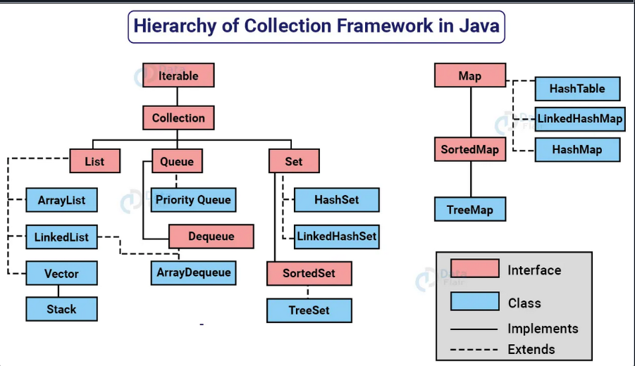

Aula replicada Dio  - Com Camila

#   **Collection Framework API**

1. [ ] Uma **coleção (collection)** é uma estrutura de dados que serve para agrupar muitos elementos em uma única unidade; estes elementos precisam ser objetos.
2. [ ] Uma Collection pode ter coleções homogêneas e heterogêneas, normalmente utilizamos coleções homogêneas de um tipo específico.
3. [ ] O núcleo principal das coleções é formado pelas interfaces da figura abaixo; essas interfaces permitem manipular a coleção independentemente do nível de detalhe que elas representam.
4. [ ] Temos quatro grandes tipos de coleções: **_`List (lista), Set (conjunto), Queue (fila) e Map (mapa).`_**  
5. [ ] A partir dessas interfaces, temos muitas subclasses concretas que implementam várias formas diferentes de se trabalhar com cada coleção.

