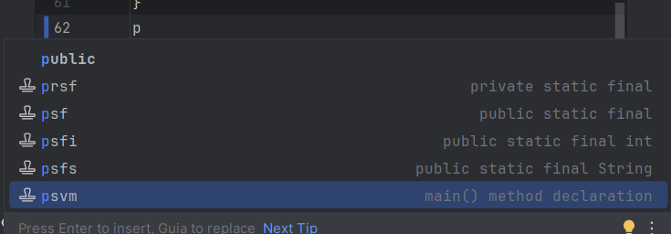

**# Comparable X Comparator**


**## Comparable**

Comparable fornece uma única sequência de ordenação. Em outras palavras, podemos ordenar a coleção com base em um único elemento, como id, nome e preço.
Comparable afeta a classe original, ou seja, a classe atual é modificada.
Comparable fornece o método compareTo() para ordenar elementos.
Comparable está presente no pacote java.lang.
Podemos ordenar os elementos da lista do tipo Comparable usando o método Collections.sort(List).


**## Comparator**

* O `Comparator` fornece o método `compare()` para ordenar elementos.
* O `Comparator` fornece múltiplas sequências de ordenação. Em outras palavras, podemos ordenar a coleção com base em múltiplos elementos, como id, nome, preço, etc.
* O `Comparator` não afeta a classe original, ou seja, a classe atual não é modificada.
* Um `Comparator` está presente no pacote `java.util`.
* Podemos ordenar os elementos da lista do tipo Comparator usando o método Collections.sort(List, Comparator).

**# Collections**

* A classe Collections é uma classe utilitária do Java para operações comuns em coleções.
* Ela fornece métodos para ordenação, busca, manipulação e sincronização de coleções.
* O método sort() é usado para ordenar uma lista em ordem ascendente.
* O método sort() em conjunto com `Collections.reverseOrder()` permite ordenar em ordem descendente.

atalho para testes de classes


`package main.java.comparableXcomparator;`

````import java.util.Comparator;

// Uma classe 'Livro' que implementa Comparable
class Livro implements Comparable<Livro> {
private String titulo;
private String autor;
private int ano;

	// Construtor
	public Livro(String ti, String au, int an) {
		this.titulo = ti;
		this.autor = au;
		this.ano = an;
	}

	// Usado para ordenar livros por ano
	public int compareTo(Livro l) {
		return titulo.compareTo(l.titulo);
	}

	// Métodos getters para acessar os dados privados
	public String getTitulo() {
		return titulo;
	}

	public String getAutor() {
		return autor;
	}

	public int getAno() {
		return ano;
	}
}````

// Classe para comparar Livro por autor
class CompararAutor implements Comparator<Livro> {
@Override
public int compare(Livro l1, Livro l2) {
return l1.getAutor().compareTo(l2.getAutor());
}
}

// Classe para comparar Livro por ano
class CompararAno implements Comparator<Livro> {
@Override
public int compare(Livro l1, Livro l2) {
if (l1.getAno() < l2.getAno())
return -1;
if (l1.getAno() > l2.getAno())
return 1;
else
return 0;
}
}

class CompararAnoAutorTitulo implements Comparator<Livro> {
@Override
public int compare(Livro l1, Livro l2) {
int ano = Integer.compare(l1.getAno(), l2.getAno());
if (ano != 0)
return ano;
int autor = l1.getAutor().compareTo(l2.getAutor());
if (autor != 0)
return autor;
return l1.getTitulo().compareTo(l2.getTitulo());
}
}

OBs: para fazer teste sem   API junit  usa-se psvm      


